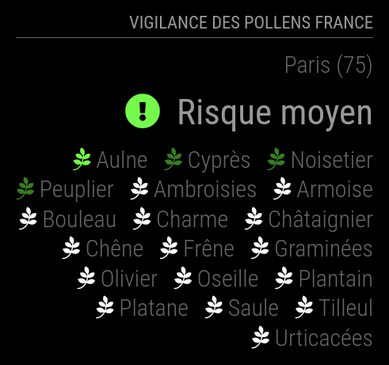

# Module: MMM-VigilancePollensFrance
> Inpired by [MMM-VigilanceMeteoFrance](https://github.com/grenagit/MMM-VigilanceMeteoFrance)

This module displays the current level of vigilance of the allergic risk to pollens set by Pollens.fr (R.N.S.A.) for each department of metropolitan france, including the associated pollens. A notification is displayed in case of a change in the level of vigilance or new risks.

Color legend display and notifications may be enabled or disabled independently. Minimum level of vigilance of displayed pollens can be set.

<p align="left">



</p>

[MagicMirror Project on Github](https://github.com/MichMich/MagicMirror) | [Pollens.fr](https://pollens.fr/)

## Installation:

In your terminal, go to your MagicMirror's Module folder:
```shell
cd ~/MagicMirror/modules
```

Clone this repository:
```shell
git clone https://github.com/grenagit/MMM-VigilancePollensFrance
```

Go to your MMM-VigilancePollensFrance's Module folder:
```shell
cd ~/MagicMirror/modules/MMM-VigilancePollensFrance
```

Install dependencies:
```shell
npm install
```

Configure the module in your config.js file.

## Update:

In your terminal, go to your MMM-VigilancePollensFrance's Module folder:
```shell
cd ~/MagicMirror/modules/MMM-VigilancePollensFrance
```

Incorporate changes from this repository:
```shell
git pull
```

Install dependencies:
```shell
npm install
```

## Configuration:

### Basic configuration

To use this module, add it to the modules array in the `config/config.js` file:
```javascript
modules: [
	{
		module: "MMM-VigilancePollensFrance",
		position: "top_left",
		config: {
			department: 75, // Department number
		}
	}
]
```

### Options

The following properties can be configured:


| Option                       | Description
| ---------------------------- | -----------
| `department`                 | The department number (metropolitan france only ; 20 for Corsica). <br><br>  This value is **REQUIRED**
| `updateInterval`             | How often does the content needs to be fetched? (Milliseconds) <br><br> **Possible values:** `1000` - `86400000` <br> **Default value:** `1 * 60 * 60 * 1000` (1 hour)
| `animationSpeed`             | Speed of the update animation. (Milliseconds) <br><br> **Possible values:**`0` - `5000` <br> **Default value:** `1000` (1 second)
| `notificationDuration`       | Time to display notification. (Milliseconds) <br><br> **Possible values:**`1000` - `86400000` <br> **Default value:** `1 * 60 * 1000` (1 minute)
| `maxPollensInline`           | Maximum number of pollens displayed on the same line. If set to 0, there is no limit. <br><br> **Possible values:**`0` - `9` <br> **Default value:** `3`
| `minPollensLevel`            | Minimum level of vigilance of displayed pollens. <br><br> **Possible values:**`0` - `5` <br> **Default value:** `1`
| `showDepartment `            | Show the department name. <br><br> **Possible values:** `true` or `false` <br> **Default value:** `false`
| `showNotification`           | Show notification (level of vigilance change or new risks). <br><br> **Possible values:** `true` or `false` <br> **Default value:** `true`
| `useColorLegend`             | Use the colored icons. <br><br> **Possible values:** `true` or `false` <br> **Default value:** `true`
| `initialLoadDelay`           | The initial delay before loading. If you have multiple modules that use the same API key, you might want to delay one of the requests. (Milliseconds) <br><br> **Possible values:** `1000` - `5000` <br> **Default value:**  `0`
| `retryDelay`                 | The delay before retrying after a request failure. (Milliseconds) <br><br> **Possible values:** `1000` - `60000` <br> **Default value:**  `2500`
| `apiBase`                    | The Pollens.fr API base URL. <br><br> **Default value:**  `'https://www.pollens.fr/'`
| `pollensEndpoint`            | The Vigilance API endPoint. <br><br> **Default value:**  `'risks/thea/counties/'`

### Integration with other modules

The following [notifications](https://github.com/MichMich/MagicMirror/wiki/notifications) can be used by other modules:

| Action                          | Notification                | Payload
| ------------------------------- | --------------------------- | -------
| Change the vigilance department | VIGI_POLLENSFRANCE_DEPARTMENT | The department number

For example, use `this.sendNotification("VIGI_POLLENSFRANCE_DEPARTMENT", 75);` if you want to change department number so that it corresponds to that of Paris (75).

## Todo:

## Testing:

To test the new features, you can use the testing branch:

- Change from master version to testing version: `git checkout testing`
- Return to master version from testing version: `git checkout master`
- Check the version used: `git branch -v`

## License:

This module is licensed under the MIT License
